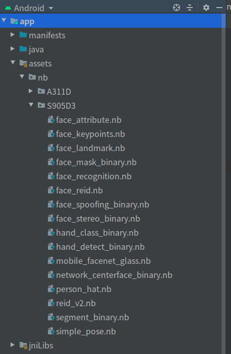

概述
本页面主要介绍 NeuSDK 在 android studio 中集成方法,以 face为例,其他算法(手势,姿态)集成方式一致.

引入opencv java module配置指导
Step 1. 通过opencv 官网 https://opencv.org/ ，下载最新的opencv-android-sdk

Step 2. 在android studio 项目中，通过FIle->new->import module ，选择下载的opencv-android-sdk中的sdk文件夹，OK引入

Step 3. sync 整个project， 在module:app 对应的build.gradle文件中，添加opencv

Step 4. 在任意 xxx.java 文件中， import org.opencv.core.Mat; 只要没有报错，即为引入成功。

NeuSDK jar包 配置指导
Step 1. android studio 中新建项目，并且引入opencv java module (引入opencv java module方法见上面)

Step 2. 请在module:app 对应的build.gradle文件中，添加打包libs目录的语句

sourceSets {

main {

jniLibs.srcDirs = ["libs"]

}

}

Step 3. 步骤二完成后， Sync 整个project， 项目工程目录下会新增app/jniLibs 目录，然后将NeuSDK.jar 放入app/jniLibs 目录下，
在app/jniLibs目录下新建armeabi-v7a 文件夹，将libneucore.so 和libopencv_java4.so 放入armeabi-v7a文件夹， 再一次sync project， 完整的app/libs 目录结构如下:

特别提醒： 一定是要 使用 step2 方式添加jniLibs目录，自己手动创建无效

NeuSDK nb 文件 存放位置指导
step1. android stuido 添加 assets文件夹

Step2. 在assets文件夹下，创建nb文件夹，把NeuSDK 中 nb文件夹下对应平台所有的nb文件拷贝到 assets/nb/平台名称 目录，

例如assets/nb/S905D3 目录下，完整结果如下: (nb文件名称和个数可能随版本不同而不同)

step3. build整个工程后, assets/nb/文件夹和里面的xxx.nb文件就会打包到apk中了

NeuSDK nb 文件 在板子上解析指导

通过以上操作, nb文件会被打包到apk中,在安装完apk后,还需要将打包到apk中的nb文件解析到指定目录

通过在java层添加如下函数实现nb文件的解析

public void copyAssetResource2File(Context context)
{
long begin = System.currentTimeMillis();

    String OrgFilepath = "/storage/emulated/0/neucore/";
    String ModelFilepath = "/storage/emulated/0/neucore/nb/";

    try {
        //判断 /storage/emulated/0/neucore/ 路径是否存在
        File orgpath = new File(OrgFilepath);
        if(! orgpath.exists()){
            orgpath.mkdirs();
        }

        //判断 /storage/emulated/0/neucore/nb/ 路径是否存在
        File despath = new File(ModelFilepath);
        if(! despath.exists()){
            despath.mkdirs();
        }

        /**
         * 下面代码将assets目录下 nb 文件夹下所有的文件拷贝到定义的 /storage/emulated/0/neucore/nb/ 路径下
         * 可在此添加限制,只在apk首次启动或者 /storage/emulated/0/neucore/nb/路径被删除 时做此操作,
         * 达到节约时间目的
         */

        //for S905D3(根据自己的平台实际情况，如果不是S905D3平台，可不添加)
        String ModelFileName = "nb/S905D3/";
        String tmp_ModelFilepath = ModelFilepath + "S905D3/";
        File tmp_path = new File(tmp_ModelFilepath);
        if(! tmp_path.exists()){
            tmp_path.mkdirs();
        }

        String[] filenames = context.getAssets().list(ModelFileName);
        for (String file : filenames) {
            InputStream is = context.getAssets().open(ModelFileName + file);

            File outF = new File(tmp_ModelFilepath+file);
            FileOutputStream fos = new FileOutputStream(outF);

            int byteCount;
            byte[] buffer = new byte[1024];
            while ((byteCount = is.read(buffer)) != -1) {
                fos.write(buffer, 0, byteCount);
            }
            fos.flush();
            is.close();
            fos.close();
            outF.setReadable(true);
        }

        //for A311D(根据自己的平台实际情况，如果不是A311D平台，可不添加)
        ModelFileName = "nb/A311D/";
        tmp_ModelFilepath = ModelFilepath + "A311D/";
        tmp_path = new File(tmp_ModelFilepath);
        if(! tmp_path.exists()){
            tmp_path.mkdirs();
        }

        filenames = context.getAssets().list(ModelFileName);
        for (String file : filenames) {
            InputStream is = context.getAssets().open(ModelFileName + file);

            File outF = new File(tmp_ModelFilepath+file);
            FileOutputStream fos = new FileOutputStream(outF);

            int byteCount;
            byte[] buffer = new byte[1024];
            while ((byteCount = is.read(buffer)) != -1) {
                fos.write(buffer, 0, byteCount);
            }
            fos.flush();
            is.close();
            fos.close();
            outF.setReadable(true);
        }

        Log.e(TAG,"NEUCORE copyAssetResource2File cost " + (System.currentTimeMillis() - begin)+" ms");
    } catch (IOException e) {
        e.printStackTrace();
    }
}

其他必要的修改
修改 /vendor/etc/public.libraries.txt 文件
adb root后vi打开/vendor/etc/public.libraries.txt 文件，增加libovxlib.so，并重启

关闭selinux
每次重启后selinux 权限设置会恢复默认值，请再次执行关闭selinux 操作   adb shell setenforce 0

apk必要的权限
apk中必须授予两个权限

android.permission.INTERNET                               此权限用来联网激活

android.permission.WRITE_EXTERNAL_STORAGE            此权限用来读取/storage/emulated/0/neucore 路径下文件

libjpeg.so 问题
如果遇到找不到libjpeg.so 问题，请拷贝一份system/lib下的libjpeg.so到vendor/lib,

cp system/lib/libjpeg.so vendor/lib